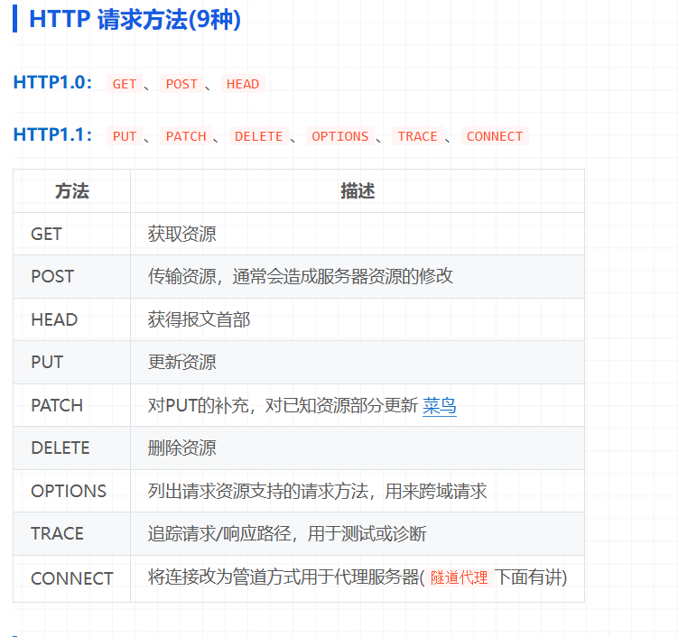

### 计算机组成原理（上午题6分）
<!--  -->
***1.进制转换***
   **1.1 R进制转十进制：按权展开**
    正数部分为R的0，1，2，3依次递增作为指数，再乘以所在位的数据。
    小数部分为R的-1，-2依次递减，再乘以所在位的数据。
    最终进行相加。
    **1.2 十进制转R进制：短除法**
        取余数，从下往上列
***2.数据表示***
    **2.1 原码反码补码移码**
        1. 原码转反码
    当原码的真值为正数时，反码的机器数就等于原码的机器数
    当原码的真值为负数时，反码的机器数等于原码的机器数取反（符号位不变）
        2.原码转补码 
    当原码的真值为正数时，补码的机器数就等于原码的机器数
    当原码的真值为负数时，补码的机器数等于原码的机器数取反再加1（符号位不变） 
        3.原码转移码 
    当原码的真值为正数时，移码的机器数等于原码，但是符号位要改变
    当原码的真值为负数时，移码的机器数等于原码机器数取反加1（符号位取反）
        4.表达式
        移码表达式，就单个因数（减数）取移码，之后进行相加减
    **2.2 表示范围**
    原码和反码：-127到127
    补码：-128到127
***3.浮点数运算***

***4.CPU结构***

***5.flynn计算机体系结构***

***6.CISC和RISC***

***7.流水线***
概念：取指-》分析-》执行
**6.1流水线的计算**
计算公式：1条指令时间+（总指令数-1）*流水线周期
！！理论公式：（t1+t2+...+tk)+(n-1)*tt（时间周期：多个环节中最长的时间）
实践公式：（k+n-1)*tt

**6.2流水线的加速比**
S=不使用流水线的执行时间（一条指令的时间*指令总数）/使用流水线的时间（理论公式）
加速比越大越好
**6.3吞吐率（速度，效率）**
吞吐率TP=指令条数/流水线执行时间

计算流水线效率的公式为：
